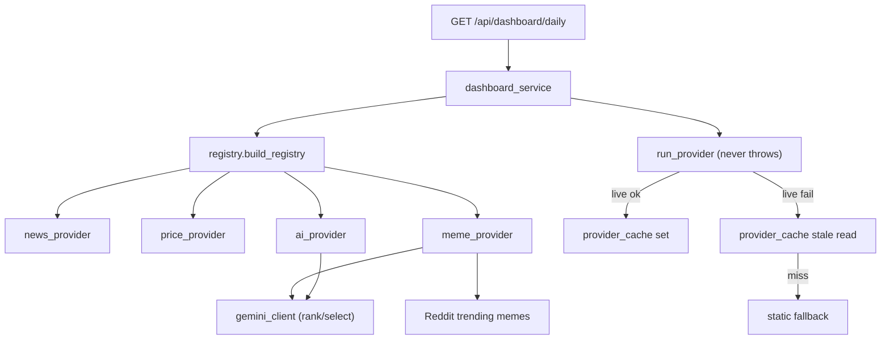

# Phase 4 - Providers and Dashboard Aggregation

## Decisions locked
- Providers per section (all free-tier), selectable via config:
  - Prices: CoinGecko REST `simple/price` at runtime (keyless). The CoinGecko MCP server + Agent SKILL are set up as Cursor/agent dev tools only (to build and verify the integration with live data), NOT called by the Flask backend at runtime.
  - News: CryptoPanic (free API key) + keyless RSS as a swappable alternative
  - AI Insight: Google Gemini `gemini-1.5-flash` (free API key) + deterministic template as swappable alternative
  - Meme: Reddit discovery + Gemini selection. Pull trending crypto memes from Reddit public JSON, then Gemini ranks/selects the most viral + preference-relevant meme using text metadata (title, subreddit, upvotes, comments) plus the user's quiz answers. Keyless Reddit; reuses the shared Gemini client.
- Modularity: config-driven registry. A `build_registry(config)` returns `{section: provider_instance}` chosen by env vars, so swapping a provider is a one-line config change. This satisfies the "swappable providers" rule in `.cursor/rules/backend-api-conventions.mdc`.

## Slice P4-S0: CoinGecko dev tooling (MCP + SKILL)
- Add the CoinGecko MCP server to Cursor config `.cursor/mcp.json`:
  `{ "mcpServers": { "coingecko": { "url": "https://mcp.api.coingecko.com/mcp" } } }`
- Install the CoinGecko Agent SKILL so the agent knows CoinGecko endpoints/params: run `npx skills add coingecko/skills -g -y` (or clone `github.com/coingecko/skills` into the Cursor skills directory).
- These are dev/agent aids only; no backend runtime dependency. Verify by listing CoinGecko tools in an agent session.

## Architecture

## Contracts

Section envelope (one per provider):
`{"data": <payload|null>, "error": null | {"code","message"}, "stale": false}`

`GET /api/dashboard/daily` (login required) success `data`:
`{"generated_at": "<iso>", "sections": {"news": <sec>, "prices": <sec>, "insight": <sec>, "meme": <sec>}}`
- Always HTTP 200 when authenticated; per-section failures live inside `error`/`stale`, never break the whole response.

Provider run fallback order: live fetch (timeout) -> on success cache-set + return fresh -> on failure serve last cached payload as `stale:true` -> else static fallback payload with `error` set.

## Slice P4-S1: Provider interface + cache + config
- `backend/app/providers/__init__.py`
- `backend/app/providers/base_provider.py`: `BaseProvider` ABC (`section`, `name`, `fetch(context) -> dict`); `run_provider(provider, context, cache, config)` wrapper that applies timeout handling, catches all exceptions, and applies the live->cache->static fallback chain (never throws to callers).
- `backend/app/repositories/provider_cache_repository.py`: `get_cached(conn, key)` (returns payload + whether expired), `set_cached(conn, key, payload, ttl)` using existing `provider_cache` table.
- Edit `backend/app/config.py`: add `PROVIDER_HTTP_TIMEOUT`, `PROVIDER_CACHE_TTL`, `*_PROVIDER` selectors, `CRYPTOPANIC_API_KEY`, `GEMINI_API_KEY`, `REDDIT_MEME_SUBREDDITS`, `REDDIT_USER_AGENT`.
- Test `backend/tests/test_provider_base.py`: fake providers for success, raises-exception, and cache-stale-fallback paths.

Shared provider behavior (all slices below): use `requests` with `PROVIDER_HTTP_TIMEOUT`, minimal 1 retry, validate/map external JSON to our shape, return a static fallback on any issue, and never raise to the caller. Each slice adds its own test file.

## Slice P4-S2: Shared Gemini client
- `backend/app/providers/gemini_client.py`: `generate(prompt, config) -> str` calling the Gemini REST endpoint (`gemini-1.5-flash`), timeout, key from `config.GEMINI_API_KEY`, raises a typed error on failure so callers can fall back.
- Add `requests` to `backend/requirements.txt`.
- Test `backend/tests/test_gemini_client.py`: monkeypatched success, timeout, non-200, missing key.

## Slice P4-S3: Price provider (CoinGecko REST)
- `backend/app/providers/price_provider.py`: `CoinGeckoPriceProvider` calling REST `simple/price` for the user's `interested_assets` (map quiz ids -> CoinGecko ids); returns `{coin: {usd, change_24h}}`.
- Static fallback: last cached or a small default coin set with null prices + error.
- Test `backend/tests/test_price_provider.py`: success, timeout, non-200, malformed payload.

## Slice P4-S4: News provider (CryptoPanic + RSS)
- `backend/app/providers/news_provider.py`: `CryptoPanicNewsProvider` (uses `CRYPTOPANIC_API_KEY`) and keyless `RssNewsProvider` variant in the same module; both map to `{items: [{title, url, source, published_at}]}`.
- Test `backend/tests/test_news_provider.py`: success, timeout, non-200, malformed payload for both variants.

## Slice P4-S5: AI insight provider (Gemini + template)
- `backend/app/providers/ai_provider.py`: `GeminiInsightProvider` builds a prompt from prices + quiz prefs and calls `gemini_client.generate`; deterministic `TemplateInsightProvider` variant needs no key. Output `{insight_text, generated_by}`.
- Fallback: Gemini failure -> template insight.
- Test `backend/tests/test_ai_provider.py`: Gemini success, Gemini failure -> template, template-only path.

## Slice P4-S6: Meme provider (Reddit + Gemini)
- `backend/app/providers/meme_provider.py`: two-step pipeline:
  1. Discover: fetch trending crypto memes from Reddit public JSON (`REDDIT_MEME_SUBREDDITS`, e.g. `cryptocurrencymemes`, `CryptoMemes`, `bitcoin`) with `REDDIT_USER_AGENT`; keep image posts only; collect title, subreddit, permalink, image url, upvotes, num_comments.
  2. Select: send candidate metadata + user quiz prefs (interested_assets, investor_type, content_preferences) to Gemini via `gemini_client`, asking for structured JSON (chosen index + reason); validate the index against candidates.
- Fallbacks: Gemini fails -> highest-upvoted candidate; Reddit fails -> stale cache -> static fallback meme. Never raises.
- Test `backend/tests/test_meme_provider.py`: Gemini-selection success, Gemini-down uses top upvotes, Reddit-down uses static.

## Slice P4-S7: Registry + dashboard service + route
- `backend/app/providers/registry.py`: `PROVIDER_IMPLEMENTATIONS` map (section -> {name: class}) and `build_registry(config)` selecting instances from config.
- `backend/app/services/dashboard_service.py`: load user preferences (interested_assets) to build provider `context`, run all providers via `run_provider`, assemble `sections` + `generated_at`.
- `backend/app/routes/dashboard_routes.py`: `dashboard_bp`, `GET /api/dashboard/daily` with `@login_required`.
- Edit `backend/app/__init__.py`: register `dashboard_bp`.
- Test `backend/tests/test_dashboard_route.py`: mixed success/failure across sections; verify one provider failure does not block others and response stays 200.

## Config / secrets
- Keys read from env only (per security baseline); add `backend/.env.example` documenting `CRYPTOPANIC_API_KEY`, `GEMINI_API_KEY`, selector vars, and Reddit meme settings. Ensure `.env` stays gitignored.
- CoinGecko MCP/SKILL are dev tooling and require no runtime secret (keyless MCP server).

## Git workflow
- Branch `phase/4-providers-dashboard` off master; one TODO branch per slice (`p4-s0-*` dev tooling through `p4-s7-*` dashboard). Auto-merge each into the phase branch after its tests pass; ask before merging phase -> master. (Note: `.cursor/mcp.json` / SKILL setup in P4-S0 has no tests; commit it as a `chore`.)
