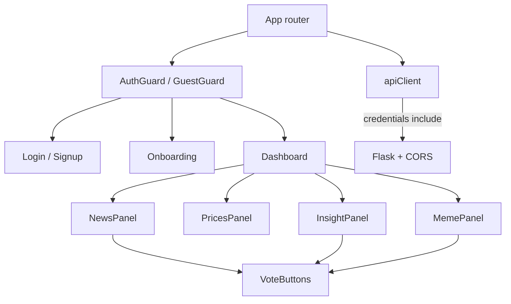

# Phase 6 - Frontend Screens

## Model routing
Switch models mid-phase; one model is not required for the whole phase. Default to **Auto** only if Composer and GPT-5.5 are available on your Cursor plan.

| Model | Owns |
| --- | --- |
| **Composer** | Cosmic Night / shadcn theme, Login, Signup, Onboarding UI, Dashboard panels, VoteButtons visuals, light transitions |
| **GPT-5.5** | Flask CORS, `apiClient`, AuthContext, route guards, `itemIds` / vote logic, all Vitest tests, docs |

Suggested order: `p6-s0-gpt` → `p6-s0-composer` → `p6-s1-gpt` → `p6-s1-composer` → `p6-s2-composer` → `p6-s2-gpt` → `p6-s3-composer` → `p6-s3-gpt` → `p6-docs-gpt`.

## Decisions locked
- **Theme (cosmetic reference):** Cosmic Night via tweakcn/shadcn registry:
  - In `frontend/`: `npx shadcn@latest add https://tweakcn.com/r/themes/cosmic-night.json`
  - Applies CSS variables (violet/purple cosmic palette, Inter + JetBrains Mono, `radius: 0.5rem`) into the shadcn theme layer.
  - Use theme tokens only (`bg-background`, `text-foreground`, `bg-primary`, `border`, `card`, etc.) — do not hardcode one-off hex colors.
- **Color mode:** Follow system preference by default; include a simple light/dark toggle (persist in `localStorage`). Apply Cosmic Night `light` / `dark` CSS var sets via a `class="dark"` (or equivalent) on the root.
- **Brand:** Display name **"AI Crypto Advisor"** as the primary wordmark on auth and app chrome (not just nav text).
- **Auth layout:** Centered single form card with brand name above (Login / Signup). Link between login ↔ signup.
- **Dashboard layout (asymmetric):**
  - Top row: News | Prices (equal columns)
  - Bottom row: Insight (wide, ~2/3) | Meme (~1/3)
  - Responsive: stack to single column on small screens (news → prices → insight → meme).
- **Motion:** Light transitions only — short page/content fade-in, panel appear, and hover/focus on interactive controls. No heavy animation libraries; prefer CSS `transition` / simple Tailwind animate utilities.
- **Component kit:** Official shadcn/ui init + only the primitives we need (Button, Input, Label, Card, plus Checkbox/RadioGroup or ToggleGroup for onboarding; Switch or similar for theme toggle). No speculative component dump.
- **Tests:** Vitest + Testing Library page/component tests with mocked `apiClient` (covers the four critical flows). Real browser e2e (Playwright) deferred to Phase 7.
- **Votes:** Optimistic UI only — no new `GET /api/feedback/votes`. Prior votes are not hydrated on reload.
- **`item_id` (client-derived):** news → item `url`; meme → `permalink` (fallback `image_url`); insight → `insight-{YYYY-MM-DD}` from `generated_at`. Prices are not votable.
- **CORS:** Enable Flask-CORS for `http://localhost:5173` (configurable via `CORS_ORIGINS`) with `supports_credentials=True` so session cookies work cross-origin in local dev.

## Prerequisites (done on master)
Auth, onboarding, dashboard, and feedback APIs are live. Frontend is still a shell ([`frontend/src/App.tsx`](frontend/src/App.tsx), [`apiClient.ts`](frontend/src/services/apiClient.ts) with `getHealth()` only).

## Architecture

## Route guard rules
- Guest (`/login`, `/signup`): redirect authenticated users to `/onboarding` or `/dashboard` based on `onboarding_completed` from `GET /api/auth/me`.
- Authed + incomplete onboarding: only `/onboarding`.
- Authed + complete: `/dashboard` (and redirect away from auth/onboarding).
- Unauthed hitting guarded routes → `/login`.

## Slice P6-S0: Foundation (CORS + apiClient + router + Tailwind)
Branch: `p6-s0-frontend-foundation` off `phase/6-frontend`.
**Models:** GPT-5.5 for backend CORS + `apiClient` + tests; Composer for Cosmic Night / shadcn / router stubs / theme toggle.

**Backend (GPT-5.5):**
- Add `flask-cors` to [`backend/requirements.txt`](backend/requirements.txt).
- In [`backend/app/__init__.py`](backend/app/__init__.py): `CORS(app, origins=..., supports_credentials=True)`.
- Config: `CORS_ORIGINS` (default `http://localhost:5173`) in [`backend/app/config.py`](backend/app/config.py); document in `.env.example`.
- Test: one route test that `Access-Control-Allow-Credentials` / origin headers appear on an OPTIONS or GET with `Origin` header.

**apiClient (GPT-5.5):**
- Expand [`frontend/src/services/apiClient.ts`](frontend/src/services/apiClient.ts): shared `request<T>()` helper + typed wrappers for all 8 endpoints (`signup`, `login`, `logout`, `me`, `getQuestions`, `saveAnswers`, `getDailyDashboard`, `vote`). Always `credentials: "include"`; parse envelope defensively.
- Add `frontend/.env.example` with `VITE_API_BASE_URL=http://localhost:5000`.
- Test: `apiClient` unit tests for success/error envelope parsing (mocked `fetch`).

**Theme + shell (Composer):**
- Install: `react-router-dom`, Tailwind, and shadcn/ui (`npx shadcn@latest init` if needed).
- Apply Cosmic Night: `npx shadcn@latest add https://tweakcn.com/r/themes/cosmic-night.json` so CSS vars land in the theme stylesheet.
- Add only needed shadcn components (`button`, `input`, `label`, `card`, onboarding controls, theme switch).
- Wire router in `App.tsx` / `main.tsx` with placeholder page stubs. Apply Cosmic Night base classes on `body` / root (`bg-background text-foreground`).
- Theme provider: system preference + `localStorage` override + toggle control in app chrome (auth pages can show a compact toggle too).

## Slice P6-S1: Auth screens + route guards
Branch: `p6-s1-auth-screens`.
**Models:** GPT-5.5 for AuthContext + guards + tests; Composer for Login/Signup UI.

**Logic (GPT-5.5):**
- [`frontend/src/auth/AuthContext.tsx`](frontend/src/auth/AuthContext.tsx) — load `me` on boot; expose `{ user, onboardingCompleted, login, signup, logout, refreshMe, status }`
- [`frontend/src/auth/guards.tsx`](frontend/src/auth/guards.tsx) — `GuestOnly`, `RequireAuth`, `RequireOnboarding`
- Tests: guard + auth flow Vitest with mocked apiClient

**UI (Composer):**
- [`frontend/src/pages/Login.tsx`](frontend/src/pages/Login.tsx), [`Signup.tsx`](frontend/src/pages/Signup.tsx)
- Shared form UI primitives under `frontend/src/components/ui/`
- Centered card under **"AI Crypto Advisor"** wordmark; email + password; client validation; loading/disabled submit; display `error.message` from envelope; light fade-in; after login/signup redirect by onboarding flag.

## Slice P6-S2: Onboarding page
Branch: `p6-s2-onboarding-page`.
**Models:** Composer for Onboarding UI; GPT-5.5 for Vitest acceptance tests.

**UI (Composer):** [`frontend/src/pages/Onboarding.tsx`](frontend/src/pages/Onboarding.tsx)
- Contract: `GET /api/onboarding/questions` → render multi/single questions (`interested_assets`, `investor_type`, `content_preferences`). `POST /api/onboarding/answers` with `{ answers: { ... } }`.
- States: loading questions, empty, submit pending, field errors, server error. Success → refresh me → navigate `/dashboard`.

**Tests (GPT-5.5):** `Onboarding.test.tsx` — load questions, submit happy path redirects, validation/server error display.

## Slice P6-S3: Dashboard page + panels + VoteButtons
Branch: `p6-s3-dashboard-panels`.
**Models:** Composer for dashboard/panel/VoteButtons UI; GPT-5.5 for `itemIds`, vote wiring, and Vitest.

**UI (Composer):**
- [`frontend/src/pages/Dashboard.tsx`](frontend/src/pages/Dashboard.tsx) — header with **"AI Crypto Advisor"**, theme toggle, logout; fetch wiring hooks into GPT-5.5 logic
- Panels: `NewsPanel`, `PricesPanel`, `InsightPanel`, `MemePanel`, `VoteButtons` under `frontend/src/components/dashboard/`
- Layout: CSS grid — top `News | Prices`; bottom `Insight (wide) | Meme`; stack on small screens. Light panel fade-in on load.
- Panel states: independent empty/error/stale; one section error must not blank other panels.

**Logic + tests (GPT-5.5):**
- Helper: `frontend/src/components/dashboard/itemIds.ts` (news `url`, meme `permalink`/`image_url`, insight `insight-{YYYY-MM-DD}`)
- VoteButtons wiring: optimistic highlight; `vote()`; on failure revert + inline error. No vote on prices.
- Tests: `Dashboard.test.tsx` mixed mocked sections + `VoteButtons.test.tsx` happy/error paths.

## Docs (GPT-5.5; after S3 or with S0)
Update per docs-maintenance:
- [`README.md`](README.md) — Phase 6 status blurb; frontend run notes
- [`docs/developer-guide.md`](docs/developer-guide.md) — CORS, `VITE_API_BASE_URL`, route map, progress snapshot → Phase 6 done on phase branch
- [`docs/testing-guide.md`](docs/testing-guide.md) — lock Vitest as Phase 6 acceptance runner; refresh suite inventory table

## Git workflow
1. From clean `master`: create `phase/6-frontend`.
2. One TODO branch per model-owned slice (or keep `p6-s0` / `p6-s1` branches and complete both model todos before merge). Auto-merge into phase after green tests.
3. Ask before merging `phase/6-frontend` → `master`.

## Out of scope (Phase 7+)
- Playwright/Cypress browser e2e
- GET votes hydration / personalization from vote history
- Provider swaps, security hardening pass, `docs/gotchas.md`
