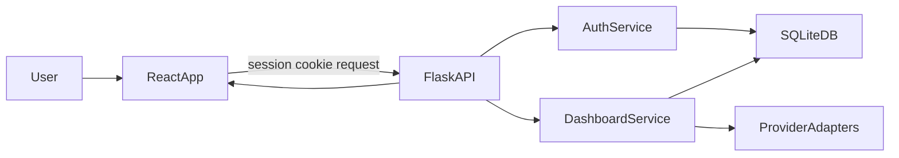

# AI Crypto Advisor MVP Architecture

## Goal

Confirm a clean, build-ready architecture for an MVP with:

- Signup/Login with server-side session cookies
- First-login onboarding quiz
- Daily dashboard (news, prices, AI insight, meme)
- Feedback voting persistence (thumbs up/down)

## Proposed Structure

- Frontend app in `frontend`
  - Styling/UI stack: `Tailwind CSS` + `shadcn/ui` components scaffolded with `v0`
  - Theme workflow: use `tweakcn` presets/tokens for a modern and consistent visual system
  - `src/pages`: `Login`, `Signup`, `Onboarding`, `Dashboard`
  - `src/components/dashboard`: `NewsPanel`, `PricesPanel`, `InsightPanel`, `MemePanel`, `VoteButtons`
  - `src/services/apiClient`: typed wrappers over backend endpoints
- Backend app in `backend`
  - `app/routes`: `auth_routes`, `onboarding_routes`, `dashboard_routes`, `feedback_routes`
  - `app/services`: business logic (auth, onboarding, aggregation, voting)
  - `app/providers`: swappable adapters (`news_provider`, `price_provider`, `ai_provider`, `meme_provider`)
  - `app/repositories`: SQLite data access (users, preferences, feedback)
- Tests
  - Frontend + backend unit tests in each app’s test folders
  - e2e tests for critical flows (auth, onboarding, dashboard render, voting)

## Core Data Model (SQLite)

- `users`: credentials + basic profile
- `user_preferences`: onboarding quiz answers per user
- `feedback_votes`: user vote by dashboard item and type (news/insight/meme)
- Optional lightweight caching table for external responses if needed for rate limits

## Security Baseline (MVP)

- Password storage: hash passwords with `bcrypt` (or `argon2`) and never store plaintext passwords.
- Session policy: HTTP-only secure cookie, `SameSite=Lax`, server-side session invalidation on logout.
- Session expiration:
  - Idle timeout: 24 hours without activity.
  - Absolute max lifetime: 7 days from login.
  - Sliding renewal on active use, capped by absolute max lifetime.
- Basic auth protections: login/signup request validation and simple login rate limiting (per IP + email) to reduce brute-force attempts.
- Access control: backend auth middleware protects onboarding, dashboard, and feedback endpoints; each request is scoped to `current_user_id` from session, never from client-provided user ids.
- Route guards (frontend): unauthenticated users can access only `Login` and `Signup`; authenticated users are redirected away from auth pages and can access only guarded app routes (`Onboarding`, `Dashboard`) based on onboarding completion state.
- Input validation: strict server-side schema validation for all auth, onboarding, and feedback payloads; mirror validations client-side for better UX.
- HTML injection protection: sanitize/escape any user-provided text before rendering, avoid unsafe HTML rendering patterns, and keep React default escaping (no `dangerouslySetInnerHTML` for user input).

## API Boundaries

- Auth
  - `POST /api/auth/signup`
  - `POST /api/auth/login`
  - `POST /api/auth/logout`
  - `GET /api/auth/me`
- Onboarding
  - `GET /api/onboarding/questions`
  - `POST /api/onboarding/answers`
- Dashboard
  - `GET /api/dashboard/daily`
- Feedback
  - `POST /api/feedback/vote`

All responses use a consistent envelope and section-level fallback behavior so one provider failure does not block full dashboard rendering.

## Request Flow

## Reliability and MVP Guardrails

- External API calls include timeout and safe fallback payloads.
- Dashboard returns partial success by section (`news`, `prices`, `insight`, `meme`) with per-section error fields.
- Keep methods/files minimal and readable; add abstractions only when they reduce duplication.
