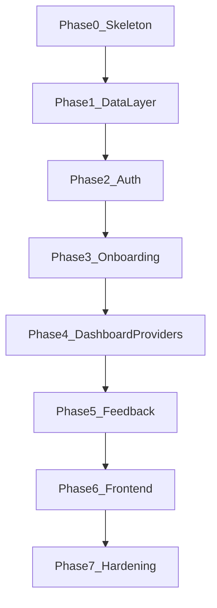

# Crypto Advisor Roadmap and Work Plan

## Goal
Produce an ordered implementation roadmap from [mvp-architecture](./mvp-architecture.md) that is easy to execute with weaker coding models (GPT-5.5 for backend/logic and Composer for UI). Each task slice is intentionally small, explicit, and testable.

## Execution Rules for Weaker Models
- Keep slices narrow: ideally one responsibility and up to 5 touched files.
- Always define exact file paths to create/edit before coding.
- Always define API contracts (request/response JSON) before frontend work.
- Build in dependency order: schema -> repositories -> services -> routes -> frontend.
- Add a test per slice (unit or e2e) and run tests before moving on.
- Require fallback behavior for every external provider integration.

## Model Routing
- Use GPT-5.5 for backend, data models, service logic, API routes, and tests.
- Use Composer for UI component/page generation and styling refinement.
- Use contract-first prompts for Composer: pass component purpose, props, loading/empty/error states, and exact backend response shape.

## Phase Plan

### Phase 0 - Project Skeleton
**Objective:** Create runnable frontend/backend foundations.

Slice P0-S1: Backend bootstrap
- Files: `backend/app/__init__.py`, `backend/app/config.py`, `backend/run.py`, `backend/requirements.txt`
- Contract: app factory + environment config + SQLite path config
- Test: backend smoke test (app starts, health route callable)
- Checkpoint: manual `GET /api/health` returns success envelope

Slice P0-S2: Frontend bootstrap
- Files: `frontend/src/main.tsx`, `frontend/src/App.tsx`, `frontend/src/services/apiClient.ts`
- Contract: root app wiring + api client stub
- Test: frontend smoke test (app renders shell)
- Checkpoint: app boot with no console/runtime errors

Slice P0-S3: Shared response envelope
- Files: `backend/app/utils/response.py` (or equivalent), one sample route
- Contract:
  - Success: `{ "ok": true, "data": {...}, "error": null }`
  - Error: `{ "ok": false, "data": null, "error": { "code": "string", "message": "string" } }`
- Test: unit test for success/error response helpers
- Checkpoint: all new routes use same envelope

### Phase 1 - Data Layer
**Objective:** Add SQLite schema and repository access.

Slice P1-S1: DB schema + migration baseline
- Files: `backend/app/db/schema.sql`, migration runner/init files
- Tables: `users`, `user_preferences`, `feedback_votes`, optional `provider_cache`
- Test: schema apply test against temp SQLite DB
- Checkpoint: migration can run on empty DB repeatedly without break

Slice P1-S2: Users repository
- Files: `backend/app/repositories/users_repository.py`
- Methods: `create_user`, `get_user_by_email`, `get_user_by_id`
- Test: unit tests for insert/select + duplicate email handling
- Checkpoint: repository methods return stable plain dict/domain shape

Slice P1-S3: Preferences + votes repositories
- Files: `backend/app/repositories/preferences_repository.py`, `backend/app/repositories/feedback_repository.py`
- Methods: `save_preferences`, `get_preferences`, `save_vote`, `get_votes_for_user`
- Test: unit tests for upsert behavior and user scoping
- Checkpoint: vote uniqueness policy enforced at DB/repository level

### Phase 2 - Auth
**Objective:** Secure signup/login/logout/me with sessions.

Slice P2-S1: Auth service
- Files: `backend/app/services/auth_service.py`
- Methods: `hash_password`, `verify_password`, `create_session`, `clear_session`
- Security: bcrypt (or argon2), no plaintext storage
- Test: unit tests for password hashing and verification
- Checkpoint: password verification fails safely for bad input

Slice P2-S2: Auth routes
- Files: `backend/app/routes/auth_routes.py`
- Endpoints: `POST /api/auth/signup`, `POST /api/auth/login`, `POST /api/auth/logout`, `GET /api/auth/me`
- Validation: strict server-side payload validation
- Test: route tests for each endpoint
- Checkpoint: envelope + status codes are consistent

Slice P2-S3: Session policy + rate limit
- Files: auth middleware/session config and simple limiter module
- Rules: HTTP-only cookie, SameSite=Lax, idle 24h, absolute 7d, login rate limit by IP+email
- Test: unit tests for middleware auth guard and limiter behavior
- Checkpoint: protected route rejects unauthenticated request

### Phase 3 - Onboarding
**Objective:** Capture first-login quiz answers and onboarding state.

Slice P3-S1: Onboarding questions endpoint
- Files: `backend/app/routes/onboarding_routes.py`, `backend/app/services/onboarding_service.py`
- Endpoint: `GET /api/onboarding/questions`
- Contract: deterministic static/fallback question set for MVP
- Test: route test for question payload shape
- Checkpoint: unauthorized access blocked

Slice P3-S2: Save answers endpoint
- Files: onboarding service/repository integration
- Endpoint: `POST /api/onboarding/answers`
- Contract: validated answers stored in `user_preferences`
- Test: unit + route test for save and validation errors
- Checkpoint: user onboarding completion flag is derivable/retrievable

### Phase 4 - Providers and Dashboard Aggregation
**Objective:** Return daily dashboard with resilient section-level fallbacks.

Slice P4-S1: Provider interfaces
- Files: `backend/app/providers/base_provider.py` + per-provider interface files
- Providers: `news_provider`, `price_provider`, `ai_provider`, `meme_provider`
- Contract: each returns `{"data": ..., "error": null}` or fallback with error metadata
- Test: interface contract tests with fake provider implementations
- Checkpoint: aggregator can call providers via interfaces only

Slice P4-S2: Free API provider implementations
- Files: provider implementation modules
- Behavior: timeout, retry policy (minimal), fallback payload
- Test: mocked HTTP tests for success, timeout, non-200, malformed payload
- Checkpoint: each provider never throws uncaught exceptions to route layer

Slice P4-S3: Dashboard service + route
- Files: `backend/app/services/dashboard_service.py`, `backend/app/routes/dashboard_routes.py`
- Endpoint: `GET /api/dashboard/daily`
- Contract: partial success by section (`news`, `prices`, `insight`, `meme`) with section error fields
- Test: service tests for mixed success/failure provider outcomes
- Checkpoint: one provider failure does not block full dashboard response

### Phase 5 - Feedback Voting
**Objective:** Persist thumbs up/down votes by signed-in user.

Slice P5-S1: Feedback service
- Files: `backend/app/services/feedback_service.py`
- Method: `save_vote(current_user_id, item_id, item_type, vote_type)`
- Validation: `item_type` in `news|insight|meme`; `vote_type` in `up|down`
- Test: unit tests for validation and persistence path
- Checkpoint: user ID always from session context, never payload

Slice P5-S2: Feedback route
- Files: `backend/app/routes/feedback_routes.py`
- Endpoint: `POST /api/feedback/vote`
- Test: route tests for happy/error/auth cases
- Checkpoint: repeated vote behavior is defined (replace or reject) and tested

### Phase 6 - Frontend (Composer-Driven)
**Objective:** Implement screens and components using stable API contracts.

Slice P6-S1: Auth screens + route guards
- Files: `frontend/src/pages/Login.tsx`, `Signup.tsx`, router config, auth guard utilities
- Composer prompt includes: form fields, validation messages, loading state, API error display
- Test: e2e auth flow (signup/login/logout)
- Checkpoint: unauth users blocked from onboarding/dashboard

Slice P6-S2: Onboarding page
- Files: `frontend/src/pages/Onboarding.tsx`
- Contract consumed: questions GET + answers POST
- States: loading, empty, submit pending, field errors, server error
- Test: e2e first-login onboarding completion
- Checkpoint: successful submit redirects to dashboard

Slice P6-S3: Dashboard page and panels
- Files: `frontend/src/pages/Dashboard.tsx`, `frontend/src/components/dashboard/*`
- Components: `NewsPanel`, `PricesPanel`, `InsightPanel`, `MemePanel`, `VoteButtons`
- States: section loading/empty/error independent per panel
- Test: e2e dashboard render with mocked mixed section success
- Checkpoint: one panel error does not hide working panels

### Phase 7 - Hardening and Delivery
**Objective:** Ensure MVP reliability and handoff readiness.

**Status:** Done on `master`.

Slice P7-S1: Validation + security pass — done
- Safe global 404/500 envelopes; sanitized provider client errors; cookie/session negative tests.

Slice P7-S2: Final test gate — done
- Playwright critical path in `e2e/`; full backend + frontend + e2e suites green.

Slice P7-S3: Release notes + gotchas — done
- File: [docs/gotchas.md](./gotchas.md)

## Dependency Flow

## Definition of Done
- Core user flow works end-to-end: signup/login -> onboarding -> dashboard -> vote.
- External provider failures degrade gracefully at section level.
- Unit and e2e coverage exists for changed/new behavior.
- Tests pass before marking slice complete.
- Big changes require user approval before commit.
- Commit messages stay short and informative (<= 180 chars).

## Next (Post-MVP, optional)
- Personalization from vote history.
- Better caching for provider responses.
- Observability dashboards and alerts.
- Deployment automation and CI optimization.
